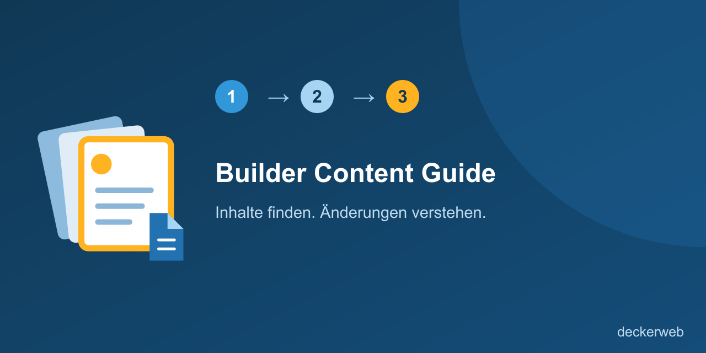

# Builder Content Guide

[English](README.md)

## Kurzvorstellung

Finde den passenden Website-Baustein, verstehe die Wirkung einer Änderung und öffne den Original-Editor. Die Website-Betreuung kuratiert eine kleine Übergabeübersicht; Inhalte bleiben in WordPress und seinen aktiven Buildern. Nicht jeder Inhalt braucht einen Guide. Starte mit häufigen Pflegeaufgaben, typischen Stolpersteinen und gemeinsam verwendeten Vorlagen, deren Änderungen mehrere Stellen betreffen.

Version 1.0.0 · Release candidate / Release-Kandidat · WordPress 7.0+ · PHP 8.0+

- [Kurzvorstellung](#kurzvorstellung)
- [Auf einen Blick](#auf-einen-blick)
- [Erste Schritte](#erste-schritte)
- [Häufige Fragen](#häufige-fragen)
- [Daten und Lebenszyklus](#daten-und-lebenszyklus)
- [Optionale Online-Dienste](#optionale-online-dienste)
- [Prüfstand](#prüfstand)
- [Änderungsverlauf](#änderungsverlauf)
- [Über den Entwickler](#über-den-entwickler)
- [Sicherheit und Unterstützung](#sicherheit-und-unterstützung)
- [Lizenz und eingebettete Komponenten](#lizenz-und-eingebettete-komponenten)

## Auf einen Blick

- Kompakte Aufgabenliste mit Suche nach Name, Zweck und Originalname, Bereichsfilter und Detailansicht. Direkte Admin-Untermenüs führen zur Inhaltssuche, Guide-Pflege und zum Hinzufügen von Einträgen.
- WordPress-Seiten, Beiträge, Template-Teile, Block-Navigation und klassische Menüs; Patterns, aktive Elementor-Free-/Pro-Dokumente, Bricks-Templates und GeneratePress-Elements.
- Manuell beschriebene Wirkung und Verwendung, Bearbeitungshinweise und bewusst aktivierte Sichtbarkeit.
- Getrennte Rechte zum Lesen und Pflegen. Bearbeitungslinks erfordern vorhandene Rechte am Original und im Builder.
- Fehlende, gelöschte oder deaktivierte Quellen behalten ihre Referenz und erhalten keinen aktiven Bearbeitungslink.
- Eine Leserhilfe erklärt die unterstützten Quellen und zeigt einen optionalen, von der Betreuung gepflegten Ansprechpartner. Zusätzliche Suchbegriffe erleichtern die Suche nach Alltagsaufgaben.
- Originale nach Provider und Inhaltstyp durchsuchen; Guides am Original hinzufügen oder finden, geprüfte Beispielseiten öffnen, geordnete Arbeitsschritte lesen, Direktlinks kopieren und Guides als ausgeblendete Entwürfe duplizieren.
- Name und Icon des obersten Admin-Menüs je Website anpassen, etwa Anleitung. Ein leerer Name stellt den übersetzten Standard Inhalte finden wieder her.

## Erste Schritte

1. Installiere das mitgelieferte Plugin-ZIP auf einer Testwebsite und aktiviere Builder Content Guide.
2. Öffne als Website-Administrator Inhalte finden → Guide pflegen.
3. Wähle zunächst wenige hilfreiche Aufgaben, etwa einen Menüpunkt umbenennen, die Telefonnummer im Footer ändern oder eine gemeinsame Kontaktvorlage pflegen.
4. Lege einen Guide-Eintrag an, wähle das Original und beschreibe Name, Zweck, Bereich, Wirkung, Verwendung und Bearbeitungshinweis.
5. Aktiviere die Sichtbarkeit bewusst. Wähle unter Guide-Zugriff ausdrücklich die Rollen, die sichtbare Einträge lesen dürfen.
6. Erprobe vor der Kundenübergabe drei reale Pflegeaufgaben mit einem Redakteur.
7. Die Menüpfade verwenden den Standardnamen Inhalte finden; ein eigener Menüname ersetzt diesen Einstieg auf deiner Website.

## Funktionen

### Aufgabenliste

Kompakte Aufgabenliste mit Suche nach Name, Zweck und Originalname, Bereichsfilter und Detailansicht. Direkte Admin-Untermenüs führen zur Inhaltssuche, Guide-Pflege und zum Hinzufügen von Einträgen.

### Unterstützte Quellen

WordPress-Seiten, Beiträge, Template-Teile, Block-Navigation und klassische Menüs; Patterns, aktive Elementor-Free-/Pro-Dokumente, Bricks-Templates und GeneratePress-Elements.

### Manuelle Erklärungen

Manuell beschriebene Wirkung und Verwendung, Bearbeitungshinweise und bewusst aktivierte Sichtbarkeit.

### Berechtigungen

Getrennte Rechte zum Lesen und Pflegen. Bearbeitungslinks erfordern vorhandene Rechte am Original und im Builder.

### Fehlende Originale

Fehlende, gelöschte oder deaktivierte Quellen behalten ihre Referenz und erhalten keinen aktiven Bearbeitungslink.

### Leserhilfe und Unterstützung

Eine Leserhilfe erklärt die unterstützten Quellen und zeigt einen optionalen, von der Betreuung gepflegten Ansprechpartner. Zusätzliche Suchbegriffe erleichtern die Suche nach Alltagsaufgaben.

### Einfacher Arbeitsablauf

Originale nach Provider und Inhaltstyp durchsuchen; Guides am Original hinzufügen oder finden, geprüfte Beispielseiten öffnen, geordnete Arbeitsschritte lesen, Direktlinks kopieren und Guides als ausgeblendete Entwürfe duplizieren.

### Menü-Integration

Name und Icon des obersten Admin-Menüs je Website anpassen, etwa Anleitung. Ein leerer Name stellt den übersetzten Standard Inhalte finden wieder her.

## Häufige Fragen

### Braucht jeder Inhalt einen Guide?

Nein. Konzentriere dich auf typische Problemfälle, Stolpersteine und häufig bearbeitete Vorlagen. Wenige verständliche Anleitungen können hilfreicher sein als ein vollständiger Katalog.

### Kopiert der Guide Templates?

Nein. Er speichert Originalreferenzen und Erklärungen. Die Originalinhalte bleiben im jeweiligen System.

### Erteilt Sichtbarkeit Bearbeitungsrechte?

Nein. Der Lesezugriff zeigt nur kuratierte Erklärungen. Die WordPress-Objektrechte und der Bricks-Builder-Zugang bestimmen weiterhin die Bearbeitung.

### Werden Verwendung und Wirkung automatisch erkannt?

Nein. Die Betreuung beschreibt sie manuell. Bei unbekannter Wirkung erscheint Verwendung prüfen. Es werden keine automatischen Verwendungszahlen angezeigt.

### Was passiert, wenn ein Original fehlt?

Die Referenz und der zuletzt bekannte Name bleiben erhalten. Die Betreuung sieht einen Prüfhinweis; Leser erhalten keine aktive Bearbeitungsaktion.

### Funktioniert das Plugin in Multisite?

Guide-Einträge und Leserfreigaben gehören zur jeweiligen Website. Netzwerkaktivierung wird unterstützt; neue Websites beginnen mit leerem Guide und ohne Rollenfreigaben.

### Was passiert bei der Deinstallation?

Guide-Einträge und Leserfreigaben bleiben erhalten. Der Updater-Cache wird entfernt. Die eingebettete Library folgt ihren gemeinsamen Regeln zur Bereinigung beim letzten Host und erhält Daten standardmäßig.

[Fragen nach Themen](docs/FAQ-de.md)

## Daten und Lebenszyklus

Private bcg_entry-Datensätze speichern den redaktionellen Namen. _bcg_data enthält Quelle, Originalkennung, zuletzt bekannten Originalnamen, Zweck, Bereich, manuelle Wirkungskategorie, Wirkungserklärung, Verwendung, Bearbeitungshinweis und Sichtbarkeit. bcg_reader_roles ist eine Option je Website. Keine Originalinhalte, Zugangsdaten oder automatische Verwendungsanalyse werden gespeichert. Deaktivierung und Deinstallation erhalten Guide-Daten. Es gibt keine Frontend-Ausgabe. Optionale Kontaktangaben werden je Website in bcg_support_contact gespeichert. Die Anzeige ist zunächst ausgeschaltet und erfolgt nur für Guide-Leser nach Aktivierung durch die Betreuung. Guide-Metadaten können zusätzliche Suchbegriffe enthalten. Beide Ergänzungen bleiben bei Deaktivierung und Deinstallation erhalten. Guide-Felder enthalten einfache Arbeitsschritte als Text und eine optionale, kuratierte HTTP-/HTTPS-Beispieladresse. Duplizieren erzeugt einen Entwurf mit deaktivierter Lesersichtbarkeit; Originalinhalte werden dabei nicht dupliziert. Menüeinstellungen werden in der Website-Option bcg_menu_settings gespeichert und bei Deaktivierung und Deinstallation erhalten. Es werden keine externen Icons geladen.

## Optionale Online-Dienste

Der Guide funktioniert lokal und benötigt keinen Cloud- oder KI-Dienst. Die eingebettete deckerweb Library 0.8.1 bietet einen optionalen Plugin-Katalog; dessen Online-Modus ist zunächst ausgeschaltet. Der deckerweb Updater 2.1.0 nutzt GitHub im normalen WordPress-Updateablauf. GitHub erhält die üblichen WordPress-HTTP-Anfragedaten und den öffentlichen Repository-Pfad. Guide-Einträge und Originalinhalte werden nicht übertragen. Das Repository und der Release-Kanal dieses Plugins sind noch nicht veröffentlicht.

## Prüfstand

Die tatsächliche Ausführung unter PHP 8.0, der Bearbeitungsablauf mit lizenziertem Bricks, echte GP-Premium-Elements und ein Kundenpilot mit drei Pflegeaufgaben müssen noch abgenommen werden. Dieses Paket ist ein Release-Kandidat; die Veröffentlichung folgt nach Abschluss der offenen Abnahmeprüfungen. Getestet mit Elementor Free 4.3.4 und Elementor Pro 4.3.1. Inaktive Dokumenttypen sind nicht verfügbar; bei fehlendem Zugriff auf die Zwischenablage wird der Link zum manuellen Kopieren markiert.

## Änderungsverlauf

### 1.0.0 — Release-Kandidat (2026-10-08)

- **Neu:** Kuratierter Content Guide für WordPress-Patterns, Bricks-Templates und GeneratePress-Elements.
- **Neu:** Leserhilfe mit unterstützten Inhaltstypen und optionalem Ansprechpartner.
- **Neu:** WordPress-Seiten, Beiträge, Template-Teile, Block-Navigation, klassische Menüs und aktive Elementor-Free-/Pro-Inhaltstypen.
- **Neu:** Durchsuchbare Originalauswahl, Links zu zugehörigen Guides, Beispielseiten, geordnete Arbeitsschritte, kopierbare Direktlinks und Duplizieren als ausgeblendete Entwürfe.
- **Neu:** Anpassbarer Admin-Menüname und lokal bereitgestelltes WordPress-Icon je Website.
- **Verbessert:** Direkte Admin-Untermenüs zum Finden von Inhalten, Pflegen des Guides und Hinzufügen von Einträgen.
- **Verbessert:** Zusätzliche Suchbegriffe, Hilfe bei erfolgloser Suche und Hinweise vor der Bearbeitung gemeinsam verwendeter Bausteine.

## Über den Entwickler

Entwickelt und gepflegt von David Decker – DECKERWEB. Builder Content Guide konzentriert sich auf eine kleine redaktionelle Übergabeübersicht.

## Sicherheit und Unterstützung

Sicherheitsmeldungen müssen vertraulich erfolgen. Vor einer öffentlichen Veröffentlichung müssen das Repository und private Sicherheitsmeldungen eingerichtet und geprüft werden. Ungepatchte Sicherheitsdetails nicht in öffentlichen Issues veröffentlichen. Siehe SECURITY-de.md.

## Fehler melden und Entwicklung unterstützen

Melde reproduzierbare Fehler über [GitHub Issues](https://github.com/deckerweb/builder-content-guide/issues), sobald das Repository verfügbar ist. Für konkrete Pflegeaufgaben auf deiner Website nutze den von der Betreuung hinterlegten Ansprechpartner.

Unterstütze die Entwicklung über [Ko-fi](https://ko-fi.com/deckerweb), [Buy Me a Coffee](https://buymeacoffee.com/daveshine) oder [PayPal](https://paypal.me/deckerweb).

## Lizenz und eingebettete Komponenten

Copyright © 2026 David Decker – DECKERWEB. GPL-2.0-or-later. Unverändert eingebettet: deckerweb Library 0.8.1 und deckerweb Updater 2.1.0 von David Decker, beide GPL-2.0-or-later. Quellen: https://github.com/deckerweb/deckerweb-plugin-library und https://github.com/deckerweb/deckerweb-updater. Kein Elementor-, Bricks- oder GP-Premium-Quellcode enthalten.

[Leserhilfe](docs/reader-help-de.md)

[Nutzungsanleitung](docs/usage-de.md)
