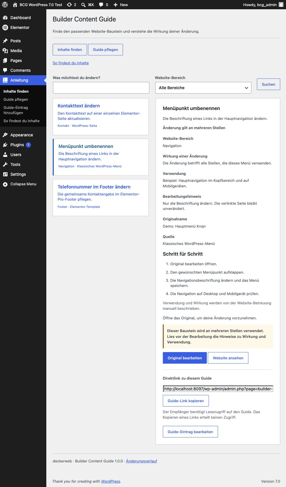

# Builder Content Guide

## About

Find the right website building block, understand what a change affects, and open its original editor. The website administrator curates a small handover guide; content stays in WordPress and its active builders. You do not need a guide for every content item. Start with frequent maintenance tasks, common stumbling blocks and shared templates whose changes affect several places.

Version 1.0.0 · Stable Release · WordPress 7.0+ · PHP 8.0+

[User guide](docs/usage.md) · [FAQ by topic](docs/FAQ.md) · [Documentation](https://deckerweb.github.io/builder-content-guide/index.html) · [Deutsch](README-de.md)

## Contents

- [At a glance](#at-a-glance)
- [Getting started](#getting-started)
- [Features](#features)
- [Everyday tasks](#everyday-tasks)
- [Frequently asked questions](#frequently-asked-questions)
- [Data and lifecycle](#data-and-lifecycle)
- [Optional online services](#optional-online-services)
- [Testing status](#testing-status)
- [Changelog](#changelog)
- [About the author](#about-the-author)
- [Issues and support](#issues-and-support)
- [Support development](#support-development)
- [License and bundled components](#license-and-bundled-components)

## At a glance

- Find everyday tasks using search and website areas.
- Open the original WordPress or builder editor with existing permissions.
- Explain usage, effects and numbered editing steps.
- Curate WordPress content, navigation and active builder templates.
- Provide reader help and an optional support contact.
- Choose reader roles and adapt the admin menu label and icon.
- Copy guide links and duplicate guides into hidden drafts.

## Getting started

1. Install the supplied plugin ZIP on a staging website and activate Builder Content Guide.
2. Open Find content → Manage guide as a website administrator.
3. Pick a few useful tasks, such as renaming a menu item, updating the footer phone number or maintaining a shared contact template.
4. Add a guide entry, choose an original and describe name, purpose, area, effects, usage and editing guidance.
5. Enable visibility deliberately. Under Guide access, explicitly select the roles that may read visible entries.
6. Try three actual maintenance tasks with an editor before using the guide for a client handover.
7. Menu paths use the default name Find content; a custom menu name replaces that entry point on your website.

## Features

### Task list

Compact task list with search by name, purpose and original title, an area filter and a detail panel. Direct admin submenus provide access to finding content, managing the guide and adding entries.

### Supported sources

WordPress pages, posts, template parts, block navigation and classic menus; patterns, active Elementor Free/Pro documents, Bricks templates and GeneratePress Elements.

### Manual explanations

Manual effect and usage explanations, editing guidance and deliberately enabled reader visibility.

### Permissions

Separate reader access and management permissions. Editor links require existing original and builder permissions.

### Missing originals

Missing, trashed and disabled sources keep their references and have no active editor link.

### Reader help and support

Reader help explains supported sources and shows an optional, administrator-maintained support contact. Extra search terms make everyday tasks easier to find.

### Everyday workflow

Search/filter originals by provider and content type; add or find guides at originals, open checked example pages, follow ordered steps, copy direct links and duplicate guides as hidden drafts.

### Menu integration

Adapt the top-level admin menu name and icon per website, for example Instructions. Leave the name empty to restore the translated default Find content.

## Everyday tasks

The German demonstration view shows three everyday tasks: change contact text, rename a menu item, and change the footer phone number. The custom menu name is Anleitung (Instructions).

[User guide](docs/usage.md)

## Frequently asked questions

### Does every content item need a guide?

No. Focus on typical problem cases, common stumbling blocks and frequently edited templates. A few clear instructions can be more useful than a complete catalog.

### Does the guide copy templates?

No. It stores original references and explanations. Original content remains in its own system.

### Does visibility grant editing permission?

No. Reader access only reveals curated explanations. WordPress object permissions and Bricks builder permissions still control editing.

### Are usage and effects detected automatically?

No. The administrator describes them manually. Unknown effects are labeled Check usage. No automatic usage counts are shown.

### What if an original disappears?

Its reference and last known title remain. The administrator sees a review notice and readers have no active edit action.

### Does it work on Multisite?

Guide entries and role grants belong to each website. Network activation is supported; new sites start with an empty guide and no role grants.

### What happens when the plugin is removed?

Guide entries and access settings remain. The updater cache is removed. The embedded Library follows its shared last-host cleanup rules and preserves data by default.

[FAQ by topic](docs/FAQ.md)

## Data and lifecycle

Guide entries, reader access, support contact and menu preferences are stored separately for each website. Original content remains in its own system. Deactivation and uninstall preserve guide data and settings. Uninstall removes the updater cache; the shared Library retains its own data by default.

## Optional online services

The guide works locally and has no cloud or AI service dependency. Bundled deckerweb Library 0.8.1 offers an optional plugin catalog; its online catalog starts disabled. The bundled deckerweb Updater 2.1.0 uses GitHub through the native WordPress update workflow. GitHub receives standard WordPress HTTP request metadata and the public repository path. No guide entries or original content are sent. Source code is available at https://github.com/deckerweb/builder-content-guide. No stable release has been published yet.

## Testing status

Runtime checks: WordPress 7.0 with PHP 8.1.29 and WordPress 7.1.3 with PHP 8.4.5. PHP 8.0 has not been tested. Tested with Elementor Free 4.3.4 and Elementor Pro 4.3.1. Inactive document types are unavailable; clipboard failure falls back to selecting the link for manual copying.

## Changelog

### 1.0.0 — Stable Release (2026-10-08)

- **New:** Curated content guide for WordPress patterns, Bricks templates and GeneratePress elements.
- **New:** Reader help with supported content types and an optional support contact.
- **New:** WordPress pages, posts, template parts, block navigation, classic menus and active Elementor Free/Pro document types.
- **New:** Searchable original selection, related guide links, example pages, ordered editing steps, copyable direct links and duplication as invisible drafts.
- **New:** Customizable site admin menu name and bundled WordPress icon.
- **Improved:** Direct admin submenus for finding content, managing the guide and adding entries.
- **Improved:** Additional search terms, help after unsuccessful searches and reminders before editing shared building blocks.

## About the author

Developed and maintained by David Decker – DECKERWEB. Builder Content Guide focuses on a small editorial handover rather than a second template library.

## Issues and support

Report vulnerabilities privately using [GitHub private vulnerability reporting](https://github.com/deckerweb/builder-content-guide/security/advisories/new). Do not publish unpatched vulnerability details in public issues. For reproducible non-security bugs use [GitHub Issues](https://github.com/deckerweb/builder-content-guide/issues).

For editing help on your website, use the support contact configured by your administrator.

## Support development

[Ko-fi](https://ko-fi.com/deckerweb) · [Buy Me a Coffee](https://buymeacoffee.com/daveshine) · [PayPal](https://paypal.me/deckerweb)

## License and bundled components

Copyright © 2026 David Decker – DECKERWEB. GPL-2.0-or-later. Bundled unchanged deckerweb Library 0.8.1 and deckerweb Updater 2.1.0 by David Decker, both GPL-2.0-or-later. Sources: https://github.com/deckerweb/deckerweb-plugin-library and https://github.com/deckerweb/deckerweb-updater. No Elementor, Bricks or GP Premium source code is included.
