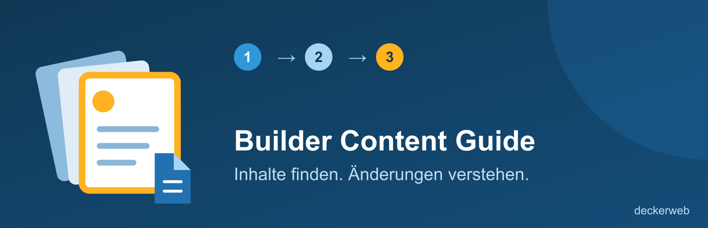

# Builder Content Guide

[English](index.html)

Kuratierte Anleitungen für alltägliche Pflegeaufgaben. Beginne mit den wenigen Änderungen, die Mitarbeiter am häufigsten erledigen: Kontakttext, Menübeschriftung und Telefonnummer in einem gemeinsamen Footer.

[Nutzungsanleitung](docs/usage-de.html) · [Fragen nach Themen](docs/FAQ-de.html) · [Repository](https://github.com/deckerweb/builder-content-guide)

WordPress 7.0+ · PHP 8.0+ · GPL-2.0-or-later.

Version 1.0.0 ist als Release-Kandidat vorbereitet. Downloadlinks stehen nach Veröffentlichung des Releases zur Verfügung.
