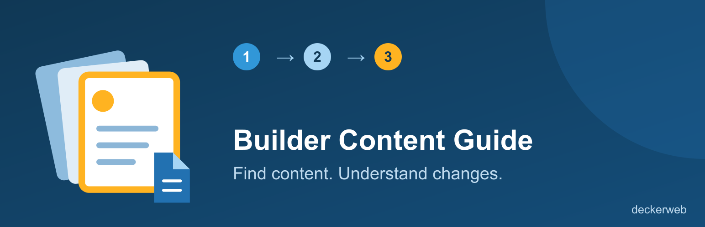

# Builder Content Guide

[Deutsch](index-de.html)

Curated instructions for everyday website tasks. Start with the few changes your staff make most often, such as contact text, navigation labels and a shared footer phone number.

[User guide](docs/usage.html) · [FAQ by topic](docs/FAQ.html) · [Repository](https://github.com/deckerweb/builder-content-guide)

WordPress 7.0+ · PHP 8.0+ · GPL-2.0-or-later.

Version 1.0.0 is prepared as a release candidate. Download links become available when the release is published.
